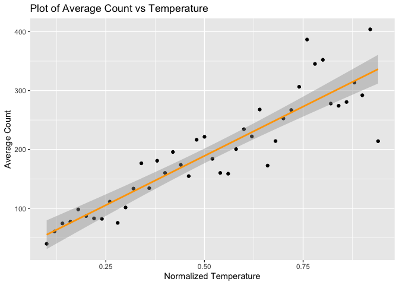
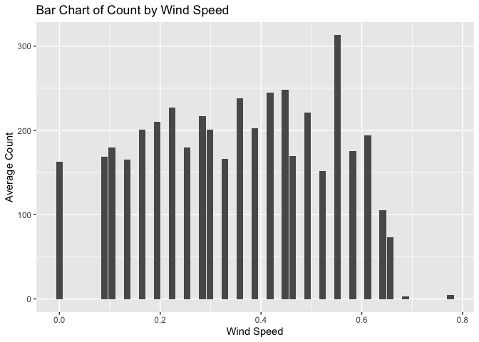

Project 2
================
Laura Mathews
10/12/2020

# Questions:

README file - do we create this in r or directly in github - separate
file automating rmarkdown - parameters

# Packages Needed

``` r
library(tidyverse)
library(tidyr)
library(caret)
library(ggplot2)
library(corrplot)
```

# Introduction

# Read in the Data

``` r
setwd("C:/Users/laura/OneDrive/Desktop/Github Repositories/Project2")

bikeData <- read_csv("hour.csv")

# Remove casual and registered columns because not needed for analysis. Also
# remove working day because unimportant for analysis of each day
bikeData$casual <- bikeData$registered <- bikeData$workingday <- NULL
```

# Filter the data for the correct day

**don’t forget to take out day \<- 2**

``` r
day <- params$day

# Filter for day

bikeData <- filter(bikeData, weekday == day)
```

# Summaries

You should produce some basic (but meaningful) summary statistics and
plots about the training data you are working with (especially as it
relates to your response). The general things that the plots describe
should be explained but, since we are going to automate things, there is
no need to try and explain particular trends in the plots you see
(unless you want to try and automate that too\!).

## Count

The minimum and maximum values and a histogram for count. A correlation
plot of all variables in the abbreviated data set.

``` r
bikeSummary <- select(bikeData, dteday:holiday, weathersit:cnt)

# Max and min count
min <- min(bikeSummary$cnt)
max <- max(bikeSummary$cnt)

paste0("The minimum count is ", min, ". The maximum count is ", max, ".")
```

    ## [1] "The minimum count is 1. The maximum count is 970."

``` r
# Histogram of Count

g <- ggplot(bikeSummary, aes(x = cnt, y = ..density..))
g + geom_histogram(binwidth = 50, fill = "yellow", color = "black") + geom_density() + 
    labs(x = "Count", y = "Density", title = "Histogram of Count")
```

<!-- -->

``` r
# Correlations and correlation plot

correlations <- cor(select(bikeSummary, season:cnt))
corrplot(correlations, type = "upper", tl.pos = "lt")
corrplot(correlations, type = "lower", method = "number", add = TRUE, diag = FALSE, 
    tl.pos = "n")
```

<!-- -->

## Summaries for different variables

???

Because the final tree will be averaging the count over different
variables, I chose to look at average count at each level of categorical
variables.

Holiday: Table of the average count on holidays and non holidays
(non-holiday = 0, holiday = 1)

Date: Data analyzed by month and year. A bar chart of average count per
month was created. The data was split up by year.

Hour: A bar chart of average count for each hour was created.

Season: A bar chart of average count for each season and a box plot were
created.

….. finish these variables: temp, humidity, windspeed, weather

``` r
# Holiday:

# See average count on holidays and non holidays

bikeSummary %>% group_by(holiday) %>% summarise(avg = mean(cnt))
```

    ## # A tibble: 2 x 2
    ##   holiday   avg
    ##     <dbl> <dbl>
    ## 1       0 193. 
    ## 2       1  44.0

``` r
# Date:

# Group the data by month and year:

# Create variables with the month, year, season, and weather names

bikeSummary <- bikeSummary %>% mutate(year = as.factor(yr), month = as.factor(mnth), 
    ssn = as.factor(season), weather = as.factor(weathersit))
levels(bikeSummary$year) <- c("2011", "2012")
levels(bikeSummary$month) <- c("Jan", "Feb", "Mar", "Apr", "May", "Jun", "Jul", "Aug", 
    "Sep", "Oct", "Nov", "Dec")
levels(bikeSummary$ssn) <- c("winter", "spring", "summer", "fall")
levels(bikeSummary$weather) <- c("Clear, Few clouds, Partly cloudy, Partly cloudy", 
    "Mist + Cloudy, Mist + Broken clouds, Mist + Few clouds, Mist", "Light Snow, Light Rain + Thunderstorm + Scattered clouds, Light Rain + Scattered clouds", 
    "Heavy Rain + Ice Pallets + Thunderstorm + Mist, Snow + Fog")

# Group by month and year and find the average count and total count.

cnt_by_date <- bikeSummary %>% group_by(month, year) %>% summarise(avg = mean(cnt), 
    total = sum(cnt))

# Create a bar chart of average count for each month. Split the data by year.

g <- ggplot(cnt_by_date, aes(x = month, y = avg))
g + geom_bar(aes(fill = as.factor(year)), position = "dodge", stat = "identity") + 
    labs(x = "Month", title = "Bar Plot of Monthly Average, Grouped by Year", y = "Average Count") + 
    scale_fill_discrete(name = "Year")
```

<!-- -->

``` r
# Hour:

# Find average count by hour

cnt_by_hr <- bikeSummary %>% group_by(hr) %>% summarise(avg = mean(cnt))

# Create a bar chart of average count for each hour.

g <- ggplot(cnt_by_hr, aes(x = hr, y = avg))
g + geom_bar(stat = "identity") + labs(x = "Hour", title = "Bar Plot of Hourly Average", 
    y = "Average Count")
```

<!-- -->

``` r
# Season:

# Find average and total count for each season.

cnt_by_season <- bikeSummary %>% group_by(ssn) %>% summarise(avg = mean(cnt), total = sum(cnt))

# Create a bar chart of average count per season.

g <- ggplot(cnt_by_season, aes(x = ssn, y = avg))
g + geom_bar(stat = "identity", fill = "green") + labs(x = "Season", title = "Bar Plot of Average Count per Season", 
    y = "Average Count")
```

<!-- -->

``` r
# Create a box plot of count by season

g <- ggplot(bikeSummary, aes(x = ssn, y = cnt))
g + geom_boxplot(color = "blue") + labs(x = "Season", title = "Box Plot of Average Count per Season", 
    y = "Count")
```

<!-- -->

``` r
# Temperature

g <- ggplot(bikeSummary, aes(x = temp, y = cnt))
g + geom_point(color = "black", size = 1) + labs(x = "Standardized Temperature", 
    title = "Count vs Temperature", y = "Count") + geom_point(aes(x = atemp), color = "grey", 
    size = 1) + geom_smooth(aes(x = temp), color = "red") + geom_smooth(aes(x = atemp), 
    color = "orange")
```

    ## `geom_smooth()` using method = 'gam' and formula 'y ~ s(x, bs = "cs")'
    ## `geom_smooth()` using method = 'gam' and formula 'y ~ s(x, bs = "cs")'

<!-- -->

``` r
g <- ggplot(bikeSummary, aes(x = temp, y = cnt))
g + geom_point(color = "black") + labs(x = "Standardized Temperature", title = "Count vs Temperature", 
    y = "Count") + geom_smooth(color = "red")
```

    ## `geom_smooth()` using method = 'gam' and formula 'y ~ s(x, bs = "cs")'

<!-- -->

``` r
# Humidity

g <- ggplot(bikeSummary, aes(x = hum, y = cnt))
g + geom_point() + geom_smooth()
```

    ## `geom_smooth()` using method = 'gam' and formula 'y ~ s(x, bs = "cs")'

<!-- -->

``` r
# Wind Speed:

cnt_wind <- bikeSummary %>% group_by(windspeed) %>% summarise(avg = mean(cnt))

g <- ggplot(cnt_wind, aes(x = windspeed, y = avg))
g + geom_bar(stat = "identity")
```

<!-- -->

``` r
g + geom_point() + geom_smooth(method = glm)
```

    ## `geom_smooth()` using formula 'y ~ x'

<!-- -->

``` r
g <- ggplot(bikeSummary, aes(x = windspeed, y = cnt))
g + geom_point() + geom_smooth()
```

    ## `geom_smooth()` using method = 'gam' and formula 'y ~ s(x, bs = "cs")'

<!-- -->

``` r
# Weather:

g <- ggplot(bikeSummary, aes(x = weather, y = cnt))
g + geom_boxplot(color = "purple") + labs(x = "Weather", y = "Count", title = "Box Plot of Count by Weather")
```

<!-- -->

# Create Train and Test Sets

Use createDataPartition() to split the bike data set into training and
testing sets with 70% of the data in the training set.

``` r
# Remove unimportant variables

bikeData <- select(bikeData, season:holiday, weathersit:cnt)

# Create index of values for training set

trainIndex <- as.vector(createDataPartition(y = bikeData$cnt, times = 1, p = 0.7, 
    list = FALSE))

# Create training and testing sets

bikeTrain <- bikeData[trainIndex, ]
bikeTest <- bikeData[-trainIndex, ]
```

# Modeling

## Tree Method

``` r
# Create a vector of cp values to test

cp_val <- seq(from = 0.01, to = 0.15, by = 0.01)

# Create a tree model

trControl <- trainControl(method = "LOOCV", number = 10)

tree <- train(cnt ~ ., data = bikeTrain, method = "rpart", trControl = trControl, 
    tuneGrid = data.frame(cp = cp_val))

tree

plot(tree)

# Plot the final tree model

plot(tree$finalModel)
text(tree$finalModel)

# Create a tree model with fewer variables. Use the same cp values

tree2 <- train(cnt ~ mnth + yr + hr + weathersit + windspeed, data = bikeTrain, method = "rpart", 
    trControl = trControl, tuneGrid = data.frame(cp = cp_val))

tree2

# Plot the 'reduced' tree model

plot(tree2$finalModel)
text(tree2$finalModel)
```

## Boosted Tree Method

**are we supposed to try different parameter values**

``` r
# Create a grid of possible parameter values; interaction.depth, n.trees,
# shrinkage, and n.minobsinnode

interaction.depth <- seq(3, 5, 1)
n.trees <- seq(250, 350, 50)
shrinkage <- seq(0.1, 0.2, 0.1)
n.minobsinnode <- seq(5, 15, 5)

parameters <- expand.grid(interaction.depth = interaction.depth, n.trees = n.trees, 
    shrinkage = shrinkage, n.minobsinnode = n.minobsinnode)

# Train the boosted tree model.

boost <- train(cnt ~ ., data = bikeTrain, method = "gbm", trControl = trainControl(method = "repeatedcv", 
    number = 10, repeats = 3), verbose = FALSE, tuneGrid = data.frame(parameters))

boost
```

# Predict on Test Set

``` r
predTree <- predict(tree, newdata = bikeTest)
treeRes <- postResample(predTree, bikeTest$cnt)
predBoost <- predict(boost, newdata = bikeTest)
boostRes <- postResample(predBoost, bikeTest$cnt)
predTree2 <- predict(tree2, newdata = bikeTest)
treeRes2 <- postResample(predTree2, bikeTest$cnt)

modNames <- c("tree", "boosted")
treeRes
boostRes
treeRes2
```

# Evaluate the Results

``` r
# Put the model results into a data frame

modNames <- c("tree", "boosted", "tree2")
results <- rbind(treeRes, boostRes, treeRes2) %>% cbind(modNames) %>% data.frame(row.names = modNames)

# Determine the best model

results$RMSE <- as.numeric(results$RMSE)

bestModel <- results %>% filter(RMSE == min(RMSE)) %>% select(modNames) %>% unlist()

# Print the best model

paste0("The best model was the ", bestModel, " model.")
```
