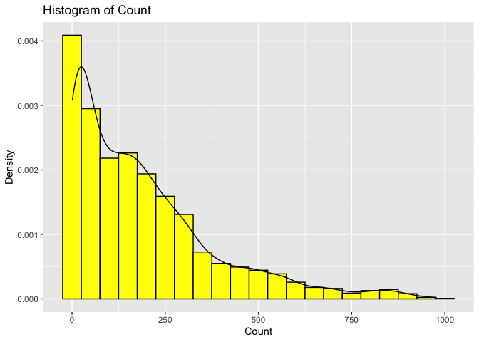
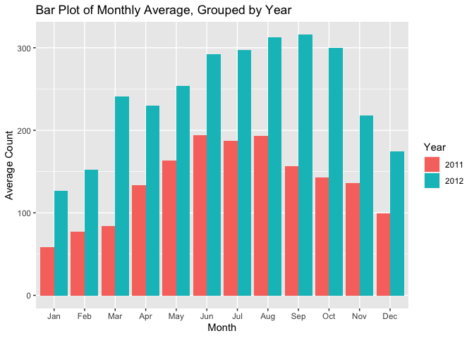
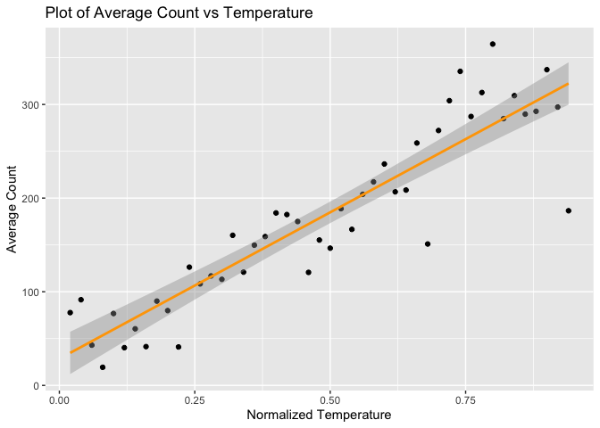
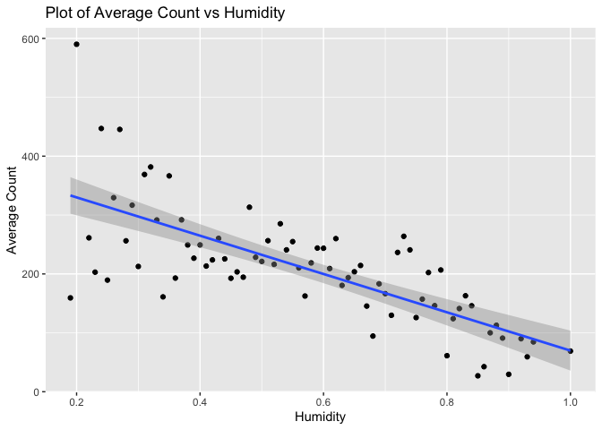

Project 2
================
Laura Mathews
10/16/2020

Packages Needed
===============

    library(tidyverse)
    library(rmarkdown)
    library(tidyr)
    library(caret)
    library(ggplot2)
    library(corrplot)

Introduction
============

The data analyzed in this project involves bike sharing systems which
allow people to rent and return bikes at different locations throughout
the city. The data set contains variables about date/time and weather
along with the count of bikes rented. The data spans multiple bike
systems, therefore there are multiple observations for each date. The
variables used in this project analysis are as follows:

-   yr: year
    -   0: 2011
    -   1: 2012
-   mnth: month, 1-12
-   season:
    -   1: winter
    -   2: spring
    -   3: summer
    -   4: fall
-   hr: hour, 0-23
-   holiday, whether or not the day is a holiday
    -   0: non-holiday
    -   1: holiday
-   weekday: day of the week, 0-6
-   weathersit: kind of weather
    -   1: Clear, Few clouds, Partly cloudy, Partly cloudy
    -   2: Mist + Cloudy, Mist + Broken clouds, Mist + Few clouds, Mist
    -   3: Light Snow, Light Rain + Thunderstorm + Scattered clouds,
        Light Rain + Scattered clouds
    -   4: Heavy Rain + Ice Pallets + Thunderstorm + Mist, Snow + Fog
-   temp: temperature, normalized temperature in Celsius, normalized by
    temp/max temp
-   hum: humidity, normalized by hum/max hum
-   windspeed: wind speed, normalized by windspeed/max windspeed
-   cnt: count of all bikes rented

The purpose of the analysis is to create models to predict the count of
bikes rented when given different situational variables. The data was
first analyzed to see which variables were most relevent to the models.
Models were made using a non-ensemble tree based method and boosted tree
method.

Read in the Data
================

    #setwd("C:/Users/laura/OneDrive/Desktop/Github Repositories/Project2")

    bikeData <- read_csv("hour.csv")

    #Remove casual and registered columns because not needed for analysis. Also remove working day because unimportant for analysis of each day
    bikeData$casual <- bikeData$registered <- bikeData$workingday <- NULL

Filter the data for the correct day
===================================

Filter the data only the desired day for the analysis.

    day <- params$day

    #Filter for day

    bikeData <- filter(bikeData, weekday == day)

Summaries
=========

Basic summary statistics and plots were created for the variables in the
data set. The data used in this project spans many bike share systems,
thus there are multiple observations for each date. Because the models
will predict the number of bikes rented in a day in a single bike share
system based on predictor variables, the summaries were produced using
average count instead of total count.

Count
-----

The minimum and maximum values were found and a histogram for count was
created.

    bikeSummary <- select(bikeData, dteday:holiday, weathersit:cnt)

    #Max and min count
    min <- min(bikeSummary$cnt)
    max <- max(bikeSummary$cnt)

    paste0("The minimum count is ", min, ". The maximum count is ", max, ".")

    ## [1] "The minimum count is 1. The maximum count is 977."

    #Histogram of Count

    g <- ggplot(bikeSummary, aes(x = cnt, y = ..density..))
    g + geom_histogram(binwidth = 50, fill = "yellow", color = "black") + geom_density() + labs(x = "Count", y = "Density", title = "Histogram of Count")

<!-- -->

Summaries for different variables
---------------------------------

Holiday: Table of the average count on holidays and non holidays
(non-holiday = 0, holiday = 1)

Date: Data analyzed by month and year. A bar chart of average count per
month was created. The data was split up by year.

Hour: A bar plot of average count for each hour was created.

Season: A bar chart of average count for each season was created.

Temperature:A plot of average count vs normalized temperature with a
linear regression line was created.

Humidity: A plot of average count vs humidity with a linear regression
line was created.

Windspeed: A bar chart of average count by wind speed was created.

Weather: A bar chart of average count for each weather condition was
created. The weather conditions are: \* 1: Clear, Few clouds, Partly
cloudy, Partly cloudy \* 2: Mist + Cloudy, Mist + Broken clouds, Mist +
Few clouds, Mist \* 3: Light Snow, Light Rain + Thunderstorm + Scattered
clouds, Light Rain + Scattered clouds \* 4: Heavy Rain + Ice Pallets

    #Holiday:

    #See average count on holidays and non holidays

    bikeSummary %>% group_by(holiday) %>% summarise(avg = mean(cnt))

    ## # A tibble: 2 x 2
    ##   holiday   avg
    ##     <dbl> <dbl>
    ## 1       0  190.
    ## 2       1  308.

    #Date:

    #Group the data by month and year:

    #Create variables with the month, year, season, and weather names

    bikeSummary <- bikeSummary %>% mutate(year = as.factor(yr), month = as.factor(mnth), ssn = as.factor(season), weather = as.factor(weathersit))
    levels(bikeSummary$year) <- c("2011", "2012")
    levels(bikeSummary$month) <- c("Jan", "Feb", "Mar", "Apr", "May", "Jun", "Jul", "Aug", "Sep", "Oct", "Nov", "Dec")
    levels(bikeSummary$ssn) <- c("winter", "spring", "summer", "fall")
    levels(bikeSummary$weather) <- c("Clear, Few clouds, Partly cloudy, Partly cloudy", "Mist + Cloudy, Mist + Broken clouds, Mist + Few clouds, Mist", "Light Snow, Light Rain + Thunderstorm + Scattered clouds, Light Rain + Scattered clouds", "Heavy Rain + Ice Pallets + Thunderstorm + Mist, Snow + Fog")

    #Group by month and year and find the average count and total count.

    cnt_by_date <- bikeSummary %>% group_by(month, year) %>% summarise(avg = mean(cnt), total = sum(cnt))

    #Create a bar chart of average count for each month. Split the data by year.

    g <- ggplot(cnt_by_date, aes(x = month, y = avg))
    g + geom_bar(aes(fill = as.factor(year)), position = "dodge", stat = "identity") + labs(x = "Month", title = "Bar Plot of Monthly Average, Grouped by Year", y = "Average Count") + scale_fill_discrete(name = "Year")

<!-- -->

    #Hour:

    #Find average count by hour

    cnt_by_hr <- bikeSummary %>% group_by(hr) %>% summarise(avg = mean(cnt))

    #Create a bar chart of average count for each hour.

    g <- ggplot(cnt_by_hr, aes(x = hr, y = avg))
    g + geom_bar(stat = "identity") + labs(x = "Hour", title = "Bar Plot of Hourly Average", y = "Average Count")

<!-- -->

    #Season:

    #Find average and total count for each season.

    cnt_by_season <- bikeSummary %>% group_by(ssn) %>% summarise(avg = mean(cnt), total = sum(cnt))

    #Create a bar chart of average count per season.

    g <- ggplot(cnt_by_season, aes(x = ssn, y = avg))
    g + geom_bar(stat = "identity", fill = "green") + labs(x = "Season", title = "Bar Plot of Average Count per Season", y = "Average Count")

<!-- -->

    #Temperature:

    #Find average count for each normalized temperature value

    cnt_temp <- bikeSummary %>% group_by(temp) %>% summarise(avg = mean(cnt))

    #Create a scatterplot of average count vs temperature and add a regression line

    g <- ggplot(cnt_temp, aes(x = temp, y = avg))
    g + geom_point() + geom_smooth(method = lm, color = "orange") + labs(x = "Normalized Temperature", y = "Average Count", title = "Plot of Average Count vs Temperature")

<!-- -->

    #Humidity:

    #Find average count for each normalized humidity value

    cnt_hum <- bikeSummary %>% group_by(hum) %>% summarise(avg = mean(cnt))

    #Create a scatterplot of average count vs humidity and add a regression line

    g <- ggplot(cnt_hum, aes(x = hum, y = avg))
    g + geom_point() + geom_smooth(method = lm) + labs(x = "Humidity", y = "Average Count", title = "Plot of Average Count vs Humidity")

<!-- -->

    #Wind Speed:

    #Find average count by wind speed

    cnt_wind <- bikeSummary %>% group_by(windspeed) %>% summarise(avg = mean(cnt))

    #Create a bar chart of average count by wind speed

    g <- ggplot(cnt_wind, aes(x = windspeed, y = avg))
    g + geom_bar(stat = "identity") + labs(x = "Wind Speed", y = "Average Count", title = "Bar Chart of Count by Wind Speed")

<!-- -->

    #Weather:

    #Find average count by weather condition

    cnt_weather <- bikeSummary %>% group_by(weathersit) %>% summarise(avg = mean(cnt))

    #Create a bar chart of average count by weather condition

    g <- ggplot(cnt_weather, aes(x = weathersit, y = avg))
    g + geom_bar(stat = "identity", fill = "purple") + labs(x = "Weather", y = "Count", title = "Bar Chart of Count by Weather")

<!-- -->

Create Train and Test Sets
==========================

Use createDataPartition() to split the bike data set into training and
testing sets with 70% of the data in the training set.

    #Remove unimportant variables

    bikeData$dteday <- bikeData$instant <- bikeData$atemp <- NULL

    #Create index of values for training set

    trainIndex <- as.vector(createDataPartition(y = bikeData$cnt, times = 1, p = 0.7, list = FALSE))

    #Create training and testing sets

    bikeTrain <- bikeData[trainIndex,]
    bikeTest <- bikeData[-trainIndex,]

Modeling
========

Tree Method
-----------

The training data was used to fit a regression tree. For a regression
tree, the predictor variables are split into different regions and a
prediction is made based on these regions.

An initial fit using the default parameter values (not included) was
used to assess the best range for the cp parameter. The cp values tested
in the fitting process were 0.01-0.15 by 0.01. Next the train()
function, from the caret package, with method rpart was used to create
the model. The best model was chosen using leave out one cross
validation. This method was specified in the trControl argument in the
train() function. The final regression tree was plotted.

    #Create a vector of cp values to test

    cp_val <- seq(from = 0.01, to = 0.15, by = 0.01)

    #Create a tree model

    trControl <- trainControl(method = "LOOCV", number = 10)

    tree <- train(cnt ~ ., data = bikeTrain, method = "rpart", 
                  trControl = trControl,
                  tuneGrid = data.frame(cp = cp_val))

    tree

    ## CART 
    ## 
    ## 1734 samples
    ##   10 predictor
    ## 
    ## No pre-processing
    ## Resampling: Leave-One-Out Cross-Validation 
    ## Summary of sample sizes: 1733, 1733, 1733, 1733, 1733, 1733, ... 
    ## Resampling results across tuning parameters:
    ## 
    ##   cp    RMSE       Rsquared   MAE      
    ##   0.01   90.61495  0.7727415   63.16723
    ##   0.02  112.21039  0.6520011   77.28730
    ##   0.03  122.57849  0.5846390   84.56754
    ##   0.04  121.72859  0.5897987   85.68436
    ##   0.05  141.36373  0.4468040   99.45091
    ##   0.06  141.36373  0.4468040   99.45091
    ##   0.07  149.57445  0.3806578  103.31340
    ##   0.08  149.57445  0.3806578  103.31340
    ##   0.09  149.57445  0.3806578  103.31340
    ##   0.10  160.35507  0.2881397  110.92653
    ##   0.11  160.35507  0.2881397  110.92653
    ##   0.12  160.35507  0.2881397  110.92653
    ##   0.13  160.35507  0.2881397  110.92653
    ##   0.14  160.35507  0.2881397  110.92653
    ##   0.15  160.35507  0.2881397  110.92653
    ## 
    ## RMSE was used to select the optimal model using the smallest value.
    ## The final value used for the model was cp = 0.01.

    #Plot the final tree model

    plot(tree$finalModel)
    text(tree$finalModel)

<!-- -->

    #Chosen model parameter values

    res <- tree$results
    res <- res %>% filter(RMSE == min(RMSE)) %>% select(cp) %>% unlist()

    paste0("The best model had a cp value of ", res)

    ## [1] "The best model had a cp value of 0.01"

Boosted Tree Method
-------------------

The training data was used to fit a boosted tree model. The boosted tree
method is an ensemble learning method. For a boosted tree, the trees are
grown sequentially. Each new tree is created by modifying the previous
tree. The predictions are updated based on the most recent tree.

Again, an initial fit using the default parameter values (not included)
was used to assess the best range in which to test each parameter. Once
an adequate range was determined, a data frame of each combination of
the possible parameter values was created. The model was trained using
the train() function with the gbm method. The tuneGrid argument was used
to specify the parameter values to be tested. The best model was chosen
using repeated 10 fold cross validation.

    #Create a grid of possible parameter values; interaction.depth, n.trees, shrinkage, and n.minobsinnode

    interaction.depth <- seq(3, 5, 1)
    n.trees <- seq(250, 350, 50)
    shrinkage <- seq(0.1, 0.2, 0.1)
    n.minobsinnode <- seq(5, 15, 5)

    parameters <- expand.grid("interaction.depth" = interaction.depth, "n.trees" = n.trees, "shrinkage" = shrinkage, "n.minobsinnode" = n.minobsinnode)

    #Train the boosted tree model.

    boost <- train(cnt ~ ., data = bikeTrain, method = "gbm", 
                      trControl = trainControl(method = "repeatedcv", number = 10, repeats = 3), verbose = FALSE, tuneGrid = data.frame(parameters))

    #Display parameters used in the final model

    res <- boost$results
    res <- res %>% filter(RMSE == min(RMSE))

    paste0("The final model had parameter values of: shrinkage = ", unlist(select(res, shrinkage)), ", interaction depth = ", unlist(select(res, interaction.depth)), ", min obs in node = ", unlist(select(res, n.minobsinnode)), ", and number of trees = ", unlist(select(res, n.trees)), ".")

    ## [1] "The final model had parameter values of: shrinkage = 0.1, interaction depth = 5, min obs in node = 5, and number of trees = 350."

Linear Regression Model
-----------------------

For part 2 of the project, we were asked to created a linear regression
model.

    Linear_Regression<-train(cnt ~ ., data= bikeTrain,
                  method= "lm",
                  trControl= trainControl(method="cv", number = 10),
                  preProcess= c("center", "scale"))

    predLR<- predict(Linear_Regression, newdata= bikeTest)
    LR_Res<- postResample(predLR, bikeTest$cnt)

Predict on Test Set
===================

The predict() function was used to predict count values from the test
set. The predictions were analyzes useing postResample() to calculate
RMSE, Rsquared, and MAE.

    #Predict test set values and analyze the predictions

    predTree <- predict(tree, newdata = bikeTest)
    treeRes <- postResample(predTree, bikeTest$cnt)
    predBoost <- predict(boost, newdata = bikeTest)
    boostRes <- postResample(predBoost, bikeTest$cnt)

    predLR<- predict(Linear_Regression, newdata= bikeTest)
    LR_Res<- postResample(predLR, bikeTest$cnt)

    #Display model fit statistics

    print("Tree fit statistics:")

    ## [1] "Tree fit statistics:"

    treeRes

    ##       RMSE   Rsquared        MAE 
    ## 89.5172200  0.7849793 62.8833046

    print("Boosted tree fit statistics")

    ## [1] "Boosted tree fit statistics"

    boostRes

    ##       RMSE   Rsquared        MAE 
    ## 45.1267965  0.9451675 28.5700257

    print("Linear Regression Statistics")

    ## [1] "Linear Regression Statistics"

    LR_Res

    ##        RMSE    Rsquared         MAE 
    ## 157.0833626   0.3355544 115.6508922

Evaluate the Results
====================

The best model used to predict the test set count values was chosen by
the smallest RMSE.

    #Put the model results into a data frame

    modNames <- c("tree", "boosted", "LinearRegression")
    results <- rbind(treeRes, boostRes, LR_Res) %>% data.frame() %>% cbind(modNames) 

    #Determine the best model

    results$RMSE <- as.numeric(results$RMSE)

    bestModel <- results %>% filter(RMSE == min(RMSE)) %>% select(modNames) %>% unlist()

    #Print the best model

    paste0("The best model was the ", bestModel, " model.")

    ## [1] "The best model was the boosted model."
